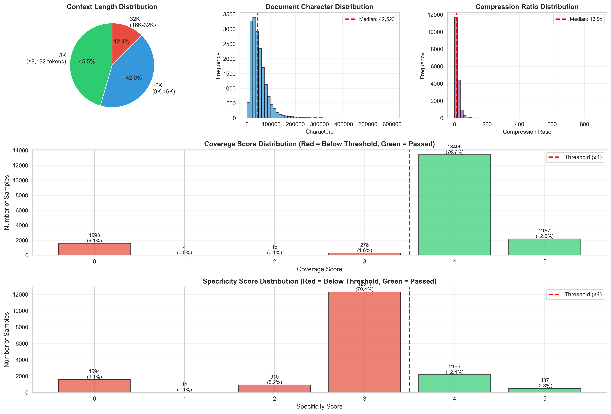

# Dataset Analysis

Comprehensive analysis of high-quality GovReport training data for QLoRA fine-tuning.

## Quick Start

```bash
cd data_analysis
jupyter notebook dataset_analysis.ipynb
```

Then run all cells: `Cell → Run All`

## What This Analysis Covers

### 1. **Dataset Size & Quality**
- Total high-quality samples after filtering
- Pass rate (coverage ≥4 AND specificity ≥4)
- Comparison with total scored samples

### 2. **Context Length Distribution** 📊
- 8K context (≤8,192 tokens)
- 16K context (8K-16K tokens)
- 32K context (16K-32K tokens)
- **Visualizations:**
  - Pie chart showing distribution
  - Boxplot by category
  - Cumulative coverage percentages

### 3. **Character & Token Statistics**
- Document lengths (min/max/mean/median)
- Summary lengths
- Compression ratios (document/summary)
- **Visualizations:**
  - Histogram of character distribution
  - Compression ratio distribution

### 4. **Score Distribution Analysis**
- Coverage score distribution (all samples)
- Specificity score distribution (all samples)
- Success/failure rates
- High-quality filter effectiveness

### 5. **Low Score Examples** 🔍
**Purpose:** Understand quality issues

- **Low Coverage (1-2):** Missing key points
- **Low Specificity (1-2):** Missing numbers, dates, names
- **Borderline (3):** Just below threshold

Each example shows:
- Sample ID
- Coverage & Specificity scores
- Document preview
- Summary preview
- Why it didn't pass the filter

### 6. **Visualizations Generated**

Saved as `dataset_distribution.png`:
- Context length pie chart
- Document character histogram
- Token distribution boxplot
- Compression ratio histogram

## Dependencies

```bash
pip install jupyter matplotlib seaborn pandas numpy datasets
```

Or using uv:
```bash
cd ..
uv sync
uv run jupyter notebook data_analysis/dataset_analysis.ipynb
```

## Output

### Console Output:
```
High-quality samples: 1,947
Total scored samples: ~18,000

Context Distribution:
  8K:   867 (44.5%)
  16K:  626 (32.2%)
  32K:  454 (23.3%)

Average document: 41,234 chars (~10,308 tokens)
Average summary: 3,156 chars (~789 tokens)
Compression: 13.1x
```

### Visualization:


## Key Insights

From this analysis, you'll understand:

1. **Context length requirements** → Why we use 32K max_seq_length
2. **Data quality** → Why we have only 2K samples (strict filtering)
3. **What makes low-quality summaries** → Examples of coverage/specificity issues
4. **Training data distribution** → How to optimize batch size and epochs

## Use Cases

- **Before training:** Understand data characteristics
- **Hyperparameter tuning:** See length distribution to choose batch size
- **Debugging:** Check low-score examples to improve prompts
- **Documentation:** Show data quality to stakeholders
